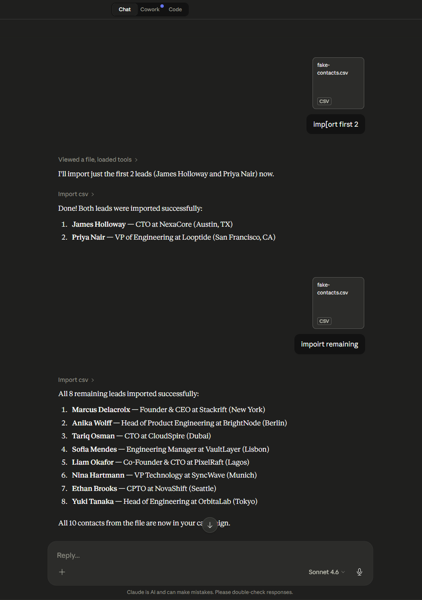
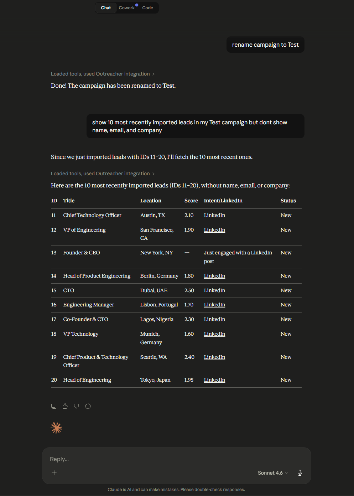

# 🚀 Demo Walkthrough

This document highlights the product experience across both deployment models:
a **Claude-powered single-tenant MCP workflow** and a **scalable multi-tenant SaaS platform**.

---

## 📑 Table of Contents
- [🧩 Single-Tenant MCP](#-single-tenant-mcp)
- [🌐 Multi-Tenant SaaS](#-multi-tenant-saas)

---

## 🧩 Single-Tenant MCP

The single-tenant MCP flow runs through **Claude Desktop**, where CSV data is ingested and processed via the MCP server.

### 📥 Claude Import CSV Slice
Initial stage of the CSV import flow inside the MCP environment.

---

### 📦 Claude Import CSV Remaining
Continuation of the import as the remaining dataset is processed.

---

### ⚙️ What This Shows
- Claude-driven import workflow  
- Slice-based ingestion for control and validation  
- Local / single-tenant execution model  

---

## 🌐 Multi-Tenant SaaS

The SaaS platform provides a **browser-based interface** for managing imports, campaigns, and leads across tenants.

---

### 🏠 SaaS Home
Main dashboard for navigating campaigns and workflows.

---

### 📥 SaaS Import CSV Slice
First stage of the SaaS CSV import pipeline.

---

### 📦 SaaS Import CSV Remaining
Continuation of the import after the initial slice is processed.

---

### ✏️ SaaS Rename Campaign
Organizing and renaming imported datasets into campaigns.

---

### 👥 SaaS Show Leads
Viewing and exploring leads after import and processing.

---

### ⚙️ What This Shows
- Multi-tenant architecture  
- Chunked / async import pipeline  
- Campaign-based organization  
- Post-import lead exploration  

---

## 🧠 Summary

These flows demonstrate two complementary ways to operate the system:

- 🧩 **Single-Tenant MCP** → controlled, Claude-driven import workflow  
- 🌐 **Multi-Tenant SaaS** → scalable, team-ready lead management platform  

---

## 🔗 Back to Main README

👉 [Return to the main README](../README.md)
